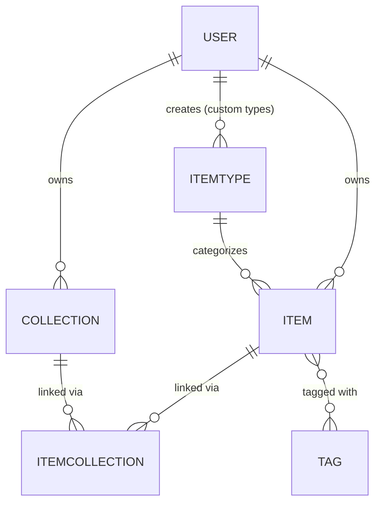

# DevStash — Project Overview

_Cleaned-up planning notes. Anything still undecided is flagged with 🚧._

## 1. Problem / Core Idea

Developers keep their essentials scattered across too many tools:

- Code snippets in VS Code or Notion
- AI prompts in chat histories
- Context files buried in projects
- Useful links in bookmarks
- Docs in random folders
- Commands in `.txt` files
- Project templates in GitHub gists
- Terminal commands in bash history

This creates context switching, lost knowledge, and inconsistent workflows. **DevStash provides one fast, searchable, AI-enhanced hub for all dev knowledge and resources.**

## 2. Target Users

| Persona                        | Needs                                                      |
| ------------------------------ | ---------------------------------------------------------- |
| **Everyday Developer**         | A fast way to grab snippets, prompts, commands, and links. |
| **AI-first Developer**         | Saves prompts, contexts, workflows, and system messages.   |
| **Content Creator / Educator** | Stores code blocks, explanations, and course notes.        |
| **Full-stack Builder**         | Collects patterns, boilerplates, and API examples.         |

## 3. Features

### A. Items & Item Types

Items can have types. Users can eventually create custom types (🚧 later phase), but the following system types ship first and cannot be edited or deleted:

- `snippet`
- `prompt`
- `note`
- `command`
- `file` (Pro only)
- `image` (Pro only)
- `link`

A type is one of three content shapes: **text** (snippet, note, prompt, command), **url** (link), or **file** (file, image).

- Each item type should have its own browsing route, e.g. `/items/snippets`.
- Items should be quick to create and view — accessible from a slide-out drawer rather than a full page navigation.

### B. Collections

- Users can create collections that hold items of any type.
- An item can belong to multiple collections (e.g., a React snippet could live in both "React Patterns" and "Interview Prep").
- Example collections: _React Patterns_ (snippets, notes), _Context Files_ (files), _Python Snippets_ (snippets).

### C. Search

Powerful search across:

- Content
- Tags
- Titles
- Types

### D. Authentication

- Email/password
- GitHub OAuth sign-in

### E. Other Features

- Favorite collections and items
- Pin items to top
- Recently used items
- Import code from a file
- Markdown editor for text-type items
- File upload for file-type items (file / image)
- Export data in multiple formats
- Dark mode (default) with light mode available
- Add/remove an item to/from multiple collections
- View which collections an item belongs to

### F. AI Features (Pro only)

- AI auto-tag suggestions
- AI summaries
- AI "explain this code"
- Prompt optimizer

## 4. Data Model

🚧 Rough draft — not finalized. Sketched below as a Prisma schema plus an ER diagram for clarity.

### Entity-relationship overview



### Prisma schema (draft)

```prisma
// User — extends NextAuth's base user model
model User {
  id                   String   @id @default(cuid())
  // ...standard NextAuth fields (name, email, image, accounts, sessions)

  isPro                Boolean  @default(false)
  stripeCustomerId     String?
  stripeSubscriptionId String?

  items       Item[]
  itemTypes   ItemType[]   // custom types created by this user
  collections Collection[]
}

enum ItemContentType {
  TEXT
  FILE
}

model Item {
  id          String           @id @default(cuid())
  title       String
  contentType ItemContentType
  content     String?          // text content, null if contentType = FILE
  fileUrl     String?          // R2 URL, null if contentType = TEXT
  fileName    String?          // original filename, null if TEXT
  fileSize    Int?             // bytes, null if TEXT
  url         String?          // for `link` type items
  description String?
  isFavorite  Boolean          @default(false)
  isPinned    Boolean          @default(false)
  language    String?          // optional, for syntax highlighting on code
  createdAt   DateTime         @default(now())
  updatedAt   DateTime         @updatedAt

  userId      String
  user        User             @relation(fields: [userId], references: [id])

  itemTypeId  String
  itemType    ItemType         @relation(fields: [itemTypeId], references: [id])

  tags        Tag[]
  collections ItemCollection[]
}

model ItemType {
  id       String  @id @default(cuid())
  name     String
  icon     String
  color    String
  isSystem Boolean @default(false)

  userId   String?           // null for system types
  user     User?             @relation(fields: [userId], references: [id])

  items    Item[]
}

model Collection {
  id            String   @id @default(cuid())
  name          String
  description   String?
  isFavorite    Boolean  @default(false)
  defaultTypeId String?  // default item type for new items added with no type set
  createdAt     DateTime @default(now())
  updatedAt     DateTime @updatedAt

  userId        String
  user          User             @relation(fields: [userId], references: [id])

  items         ItemCollection[]
}

// Join table — tracks when an item was added to a collection
model ItemCollection {
  itemId       String
  collectionId String
  addedAt      DateTime @default(now())

  item         Item       @relation(fields: [itemId], references: [id])
  collection   Collection @relation(fields: [collectionId], references: [id])

  @@id([itemId, collectionId])
}

model Tag {
  id    String @id @default(cuid())
  name  String @unique

  items Item[]
}
```

**Migration rule:** never use `db push` or edit the database schema directly. All schema changes go through Prisma migrations, run in dev first and then in prod.

## 5. Tech Stack

- **Framework:** Next.js 16 / React 19
  - SSR pages with dynamic components
  - API routes for backend needs (storing items, file uploads, AI calls)
  - Single codebase/repo to minimize overhead
- **Language:** TypeScript
- **Database & ORM:** Neon (PostgreSQL) + Prisma
  - Database hosted in the cloud
  - Prisma ORM for database connection and interaction
  - Prisma 7 (latest — check current docs before implementing)
  - Redis for caching 🚧 (maybe / not yet decided)
- **File storage:** Cloudflare R2 (file uploads)
- **Authentication:** NextAuth v5
  - Email/password
  - GitHub OAuth
- **AI integration:** OpenAI `gpt-5-nano`
- **Styling:** Tailwind CSS v4 with shadcn/ui

## 6. Monetization

Freemium model.

**Free**

- 50 items total
- 3 collections
- All system types except files/images
- Basic search
- No file or image uploads
- No AI features

**Pro — $8/month or $72/year**

- Unlimited items
- Unlimited collections
- File & image uploads
- Custom types 🚧 (later phase)
- AI auto-tagging
- AI code explanation
- AI prompt optimizer
- Data export (JSON/ZIP)
- Priority support

**Dev note:** build the Pro/free gating foundation now, but during development all users get full access to everything.

## 7. UI/UX

### General

- Modern, minimal, developer-focused
- Dark mode by default; light mode optional
- Clean typography, generous whitespace
- Subtle borders and shadows
- Visual references: Notion, Linear, Raycast
- Syntax highlighting for code blocks

### Layout

- Sidebar + main content, with a collapsible sidebar
- **Sidebar:** item types with links to their items (snippets, commands, etc.), plus latest collections
- **Main:** a grid of color-coded collection cards, background-colored by the item type that dominates that collection. Items are displayed under their collection in color-coded cards (border color = item type color).
- Individual items open in a quick-access drawer

### Screenshots

Refer to the screenshots below as a base for the dashboard UI. It does not have to be exact. Use it as a reference:

- @context/screenshots/dashboard-ui-main.png/
- @context/screenshots/dashboard-ui-drawer.png/

### Type Colors & Icons

| Type    | Color      | Hex       | Icon (Lucide) |
| ------- | ---------- | --------- | ------------- |
| Snippet | 🔵 Blue    | `#3b82f6` | `Code`        |
| Prompt  | 🟣 Purple  | `#8b5cf6` | `Sparkles`    |
| Command | 🟠 Orange  | `#f97316` | `Terminal`    |
| Note    | 🟡 Yellow  | `#fde047` | `StickyNote`  |
| File    | ⚪ Gray    | `#6b7280` | `File`        |
| Image   | 🩷 Pink    | `#ec4899` | `Image`       |
| Link    | 🟢 Emerald | `#10b981` | `Link`        |

_(Swatches above are an approximation — use the hex values as the source of truth.)_

### Responsive

- Desktop-first, but usable on mobile
- Sidebar collapses into a drawer on mobile

### Micro-interactions

- Smooth transitions
- Hover states on cards
- Toast notifications for actions
- Loading skeletons

## 8. Open Questions / To Decide

- Redis caching — needed, or is Postgres/Neon fast enough on its own?
- Custom item types — exact scope and when they ship (marked "later" in Pro features)
- `defaultTypeId` on Collection — confirm intended behavior (type pre-filled when adding a new item to that collection with no type chosen)
- Tag model — confirm whether tags are global or scoped per-user, and whether they need colors/icons like item types
- Export formats — confirm which formats beyond JSON/ZIP are in scope
