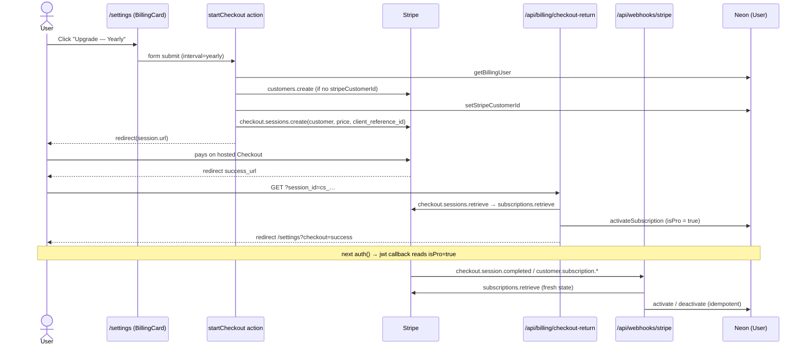

# Stripe Integration Plan — DevStash Pro

_Researched 2026-09-26 against the codebase at `3bd2066` (main) and `stripe@22.6.2` (API version `2026-08-26.dahlia`)._

Pro is **$8/month** or **$72/year**. This plan uses Stripe-hosted **Checkout** to subscribe and the Stripe **Customer Portal** to manage the subscription (switch interval, update the card, cancel). A **webhook** keeps `User.isPro` in sync. No schema migration is needed.

---

## 0. Decisions at a glance

| Decision | Choice | Why |
| --- | --- | --- |
| Payment UI | Hosted Checkout + Customer Portal (redirects) | No card forms, no Stripe.js, and no PCI scope. Cancel, plan switching and invoices come free from the portal. `STRIPE_PUBLISHABLE_KEY` is not needed. |
| Mutations | Server actions (`startCheckout`, `openBillingPortal`) that `redirect()` to Stripe | Follows the coding standards: server actions for mutations, API routes only for webhooks and redirects. |
| Source of truth | Stripe. The DB mirrors it through `syncSubscription()` | Every event **re-retrieves the subscription** instead of trusting the payload. That makes handlers idempotent, safe when events arrive out of order, and independent of the webhook endpoint's API version. |
| Who counts as Pro | Status `active`, `trialing` or `past_due` | `past_due` keeps access while Stripe retries the card. Losing access happens when Stripe moves the subscription to `canceled`/`unpaid`. (Decided, §10.) |
| User ↔ customer link | Create the Stripe Customer **before** Checkout and store `stripeCustomerId` | Every later event maps back to the user by customer id alone, and one user can't end up with duplicate customers. |
| Session freshness | The JWT callback re-reads `isPro` from the DB on every `auth()`, as the research note asks | Webhook updates show up on the next request. `trigger === "update"` is not used. |
| Checkout return race | `success_url` points at `/api/billing/checkout-return`, which syncs the session right away and then redirects | The user lands on `/settings` already Pro, even before the webhook arrives and even locally without `stripe listen`. |
| Gating switch | New `PRO_GATING` flag, set to `false` in `.env` | The spec's dev rule is that everyone gets full access during development. It follows the `RATE_LIMITING` pattern: on unless exactly `"false"`, and explicitly `true` in `.env.production`. |
| Enforcement | Server-side, in the actions and routes that create things. The UI only mirrors it | The UI can be bypassed, and the action is the check that counts (the same principle as `validateUpload`). |
| Downgrade | Keep all data. Block **new** items or collections above the limits and new file uploads | Data isn't held hostage. Existing files stay downloadable. |
| Schema | No migration | `isPro`, `stripeCustomerId @unique` and `stripeSubscriptionId @unique` already exist. The renewal date and interval are shown by the portal. |

---

## 1. Current state analysis

### 1.1 User model (`prisma/schema.prisma`)

```prisma
model User {
  ...
  isPro                Boolean @default(false)
  stripeCustomerId     String? @unique
  stripeSubscriptionId String? @unique
  editorPreferences    Json?
  ...
}
```

- All three billing columns shipped in the init migration and have never been written. `isPro` is `false` for every row. Nothing reads it except `src/lib/mock-data.ts`, which is dead code.
- Both Stripe ids are `@unique`, so `updateMany({ where: { stripeCustomerId } })` hits at most one row.
- `deleteAccount` (`src/actions/profile.ts:79`) hard-deletes the user row. **Today it would leave a live Stripe subscription billing a deleted account** (fixed in §6.9).

### 1.2 NextAuth configuration and session handling

- **`src/auth.config.ts`** holds the edge-safe config shared with the proxy: GitHub, a Credentials placeholder, `pages.signIn = "/sign-in"`, and a single `session` callback that copies `token.sub` into `session.user.id`. It has no `jwt` callback.
- **`src/auth.ts`** is the full instance: `PrismaAdapter(prisma)`, `session: { strategy: "jwt" }`, and the real `authorizeCredentials`. It spreads `authConfig`, so its callbacks are the shared ones.
- **`src/proxy.ts`** builds its own `NextAuth(authConfig)`, so it never loads Prisma. It covers `/dashboard`, `/profile`, `/settings`, `/items`, `/collections` and `/favorites`, but **not `/api`**. Every API route checks `auth()` itself.
- **`src/types/next-auth.d.ts`** augments only `Session.user.id`.

**Implication for the research note's JWT approach.** The `jwt` callback that queries Prisma must live in **`auth.ts` only**. The proxy then keeps verifying the cookie without a DB hit, and each server-side `auth()` call runs one small `isPro` query. The `session` callback in `auth.config.ts` just copies `token.isPro` through.

### 1.3 How user data is accessed

| Where | How |
| --- | --- |
| Pages | `requireUserId()` from `src/lib/session.ts`: `auth()` wrapped in React `cache`, redirecting to sign-in when there is no session. |
| `(app)` layout | Calls `auth()` **directly** (not the cached helper) for the sidebar user. Once the JWT callback queries the DB, a page request would run **two** `isPro` queries (layout + `requireUserId`). §6.3 adds a cached `getSession()` so there is one. |
| Server actions | `requireUserId()` → Zod `safeParse` → a query in `src/lib/db/*` scoped by `userId` → `ActionResult`. |
| API routes | `const session = await auth(); if (!session?.user?.id) return 401`, with a local `errorResponse(error, status)` helper. |
| Queries | `src/lib/db/users.ts`, `items.ts` and `collections.ts`. Writes that can miss use `updateMany`/`deleteMany` and return `count > 0` (see `updateEditorPreferences`, `setItemFavorite`). |

### 1.4 Existing subscription or payment code

- **No Stripe code and no `stripe` dependency.** A grep for `stripe|checkout|subscription` in `src/` finds only the schema fields and mock data.
- **Environment variables are already stubbed:**

  | Variable | `.env` | `.env.production` |
  | --- | --- | --- |
  | `STRIPE_SECRET_KEY` | set (`sk_test_…`) | blank |
  | `STRIPE_PUBLISHABLE_KEY` | set (`pk_test_…`) | blank (not needed by this plan) |
  | `STRIPE_WEBHOOK_SECRET` | **blank**: fill from `stripe listen` | blank |
  | `STRIPE_PRICE_ID_MONTHLY` | set (`price_…`) | blank |
  | `STRIPE_PRICE_ID_YEARLY` | set (`price_…`) | blank |

  So the test-mode product and prices appear to exist already. Their amounts still need checking in the Dashboard (§7.1).
- **`APP_URL` is unset on Vercel** (a known gap from the email work). `getAppUrl()` in `src/lib/auth-tokens.ts` **throws in production** without it. Checkout's `success_url`/`cancel_url` and the portal's `return_url` all depend on it, so **billing is blocked in production until `APP_URL` is set.**
- The pricing copy lives in `src/lib/home-content.ts` (`PRO_PRICING`, `FREE_PLAN`, `PRO_PLAN`). The homepage's "Go Pro" button points at `/register`.
- `PRO_ITEM_TYPES = ["file", "image"]` in `src/lib/item-types.ts` drives only the sidebar's display-only PRO badge (`SidebarTypesNav`).

---

## 2. Feature gating analysis

### 2.1 Free tier limits (project spec §6)

| Free | Pro |
| --- | --- |
| 50 items total | Unlimited |
| 3 collections | Unlimited |
| All system types except file/image | File and image uploads |
| Basic search | (same search) |
| No AI | AI tagging, summaries, explain code, prompt optimizer |
| — | Export (JSON/ZIP), custom types (later) |

### 2.2 Enforcement points

| Gate | Where it has to be checked (server) | Exists today? | UI mirror |
| --- | --- | --- | --- |
| 50-item limit | `createItem` action, `src/actions/items.ts:40` | yes | Settings usage meter. Toast from the action's error. |
| 3-collection limit | `createCollection` action, `src/actions/collections.ts:37` | yes | Same |
| File/image **items** | `createItem`: type in `PRO_ITEM_TYPES` | yes | `NewItemDialog` type picker (disable plus PRO badge); `/items/[type]` "New File/Image" button |
| File/image **uploads** | `POST /api/uploads` (`src/app/api/uploads/route.ts`). **The most important gate**, since it is what costs R2 storage | yes | Same as above |
| AI features | future actions | **not built** | Use `hasProAccess()` when they land |
| Export | future route | **not built** | Same |
| Custom types | future | **not built** (no UI; `ItemType.userId` exists) | Same |

Counts: `getItemStats` and `getCollectionStats` already return the totals (two counts each). The actions get lean `countItems`/`countCollections` one-liners, and the settings page reuses the existing stats functions.

Other paths that create items or collections today: **none**. There is no import, duplicate or API create, and the seed script bypasses actions on purpose.

### 2.3 Race note

A count-then-create check isn't atomic. Two concurrent creates at 49 items can land at 51. That's acceptable for a soft product limit. Closing it would need a transaction with a row lock, which isn't worth it here.

### 2.4 Settings page structure (`src/app/(app)/settings/page.tsx`)

```
Settings
├─ EditorPreferencesCard   (client, reads EditorPreferencesProvider)
└─ AccountActions          (server card: ChangePasswordDialog, DeleteAccountDialog)
```

Add a **`BillingCard`** between the two, so the destructive account actions stay last. The page already runs `requireUserId()` + `getProfileUser()`. It gains `getBillingSummary()` plus the two existing stats queries, run in `Promise.all`.

### 2.5 Downgrade behaviour (cancellation, failed payment)

- Existing items, collections and files are kept, editable and downloadable (`GET /api/items/[id]/download` stays ungated).
- Creating a new item is blocked while the user has ≥ 50 items. The same applies to collections at ≥ 3. New file/image items and uploads are blocked.
- Edit and delete are never gated, so a user can always get back under the limit.

---

## 3. API, action and environment patterns to follow

**Server action shape** (`src/actions/items.ts`, `collections.ts`):

```ts
"use server";
export async function doThing(input): Promise<ActionResult<T>> {
  const userId = await requireUserId();                // auth first
  const parsed = schema.safeParse(input);              // zod, fieldErrorResult on failure
  if (!parsed.success) return fieldErrorResult(parsed.error);
  try {
    ...query...
    return { success: true, data };
  } catch (error) {
    console.error("Failed to …", error);
    return { success: false, error: "Couldn't … Please try again." };
  }
  // redirect()/signOut() go OUTSIDE the try: they signal by throwing (see deleteAccount).
}
```

Form-driven actions (`changePassword`, `deleteAccount`) use the `(_previous, formData)` `useActionState` signature. The billing buttons use that one too.

**API route shape** (`src/app/api/uploads/route.ts`, `register/route.ts`): a local `errorResponse(error, status)` that returns `{ success: false, error }`, `await auth()` for the session because the proxy doesn't cover `/api`, and `request.json()` inside try/catch.

**Environment and third-party clients** (`src/lib/r2.ts`, `rate-limit.ts`, `email.ts`): read `process.env` lazily inside a getter and cache the client in a module variable, where `undefined` means not resolved yet and `null` means not configured. Warn once, and let callers degrade ("File uploads aren't available right now.", 503) instead of crashing at import. Flags live in `src/lib/feature-flags.ts`: read once, on unless exactly `"false"`. URLs come from `getAppUrl()`, never from the request `Host`.

**Tests** (`*.test.ts`, Vitest, Node): `vi.mock` the boundaries (`@/lib/prisma`, `@/auth`, `@/lib/session`) and cover the validation failure, happy path and caught error. For Stripe, mock `@/lib/stripe` (`getStripe`), never the network.

---

## 4. Architecture



Cancellation, a failed renewal or a plan switch in the portal → `customer.subscription.updated`/`deleted` → the webhook re-syncs → `isPro` flips on the user's next request.

---

## 5. Files to create

### 5.1 `src/lib/stripe.ts`: lazy client and price lookup (server only)

```ts
import Stripe from "stripe";

import type { BillingInterval } from "@/lib/plan";

// undefined = not resolved yet, null = not configured, so this only warns once.
let client: Stripe | null | undefined;

// Pinned to the SDK's own version so a Dashboard default change can't alter
// response shapes under us. Keep the webhook endpoint on the same version.
export const STRIPE_API_VERSION = "2026-08-26.dahlia";

export function getStripe(): Stripe | null {
  if (client !== undefined) {
    return client;
  }

  const secretKey = process.env.STRIPE_SECRET_KEY;
  if (!secretKey) {
    console.warn("STRIPE_SECRET_KEY is not set — billing is unavailable.");
    client = null;
    return null;
  }

  client = new Stripe(secretKey, { apiVersion: STRIPE_API_VERSION });
  return client;
}

// Price ids are resolved server side from the interval; the browser never
// chooses a price id, so it can't check out at an arbitrary price.
export function getPriceId(interval: BillingInterval): string | null {
  const priceId =
    interval === "monthly"
      ? process.env.STRIPE_PRICE_ID_MONTHLY
      : process.env.STRIPE_PRICE_ID_YEARLY;
  return priceId || null;
}
```

> `import Stripe from "stripe"` exposes both the class and the `Stripe.*` namespace types (`Stripe.Event`, `Stripe.Subscription`). Files that only need types use `import type Stripe from "stripe"`.

### 5.2 `src/lib/plan.ts`: limits and access rules (pure, unit-testable)

```ts
import { PRO_GATING_ENABLED } from "@/lib/feature-flags";
import { PRO_ITEM_TYPES } from "@/lib/item-types";

export const FREE_ITEM_LIMIT = 50;
export const FREE_COLLECTION_LIMIT = 3;

export const BILLING_INTERVALS = ["monthly", "yearly"] as const;
export type BillingInterval = (typeof BILLING_INTERVALS)[number];

// Subscription statuses that grant Pro. past_due keeps access while Stripe
// retries the card; it becomes canceled/unpaid if the retries run out.
const PRO_SUBSCRIPTION_STATUSES = new Set(["active", "trialing", "past_due"]);

export function isProStatus(status: string): boolean {
  return PRO_SUBSCRIPTION_STATUSES.has(status);
}

// With gating off (development), every account gets Pro features.
export function hasProAccess(isPro: boolean): boolean {
  return isPro || !PRO_GATING_ENABLED;
}

export function canUseItemType(isPro: boolean, typeName: string): boolean {
  return !PRO_ITEM_TYPES.includes(typeName) || hasProAccess(isPro);
}

export function isOverLimit(isPro: boolean, count: number, limit: number): boolean {
  return !hasProAccess(isPro) && count >= limit;
}

export const PLAN_ERRORS = {
  itemLimit: `You've reached the Free plan's ${FREE_ITEM_LIMIT}-item limit. Upgrade to Pro for unlimited items.`,
  collectionLimit: `You've reached the Free plan's ${FREE_COLLECTION_LIMIT}-collection limit. Upgrade to Pro for unlimited collections.`,
  proType: "File and image items are a Pro feature.",
  uploads: "File uploads are a Pro feature.",
} as const;
```

> **Client caveat:** `PRO_GATING_ENABLED` reads `process.env` at module load. In a client bundle `PRO_GATING` is undefined, so the flag would read as **on**. Client components must therefore **not** call `hasProAccess()` themselves. They get the server-computed value from `PlanProvider` (§5.8). `BILLING_INTERVALS` and the constants are safe to import anywhere.

### 5.3 `src/lib/billing.ts`: Stripe ↔ DB sync (server only)

```ts
import type Stripe from "stripe";

import { isProStatus } from "@/lib/plan";
import {
  activateSubscription,
  deactivateSubscription,
  getBillingUser,
  setStripeCustomerId,
  type BillingUser,
} from "@/lib/db/users";

function getCustomerId(customer: string | Stripe.Customer | Stripe.DeletedCustomer): string {
  return typeof customer === "string" ? customer : customer.id;
}

// Re-reads the subscription rather than trusting an event payload, so a
// duplicate, late or out-of-order event just re-applies Stripe's current state.
export async function syncSubscription(stripe: Stripe, subscriptionId: string): Promise<void> {
  const subscription = await stripe.subscriptions.retrieve(subscriptionId);
  const customerId = getCustomerId(subscription.customer);

  if (isProStatus(subscription.status)) {
    await activateSubscription(customerId, subscription.id);
  } else {
    await deactivateSubscription(customerId, subscription.id);
  }
}

export async function handleStripeEvent(stripe: Stripe, event: Stripe.Event): Promise<void> {
  switch (event.type) {
    case "checkout.session.completed": {
      const session = event.data.object;
      if (session.mode === "subscription" && typeof session.subscription === "string") {
        await syncSubscription(stripe, session.subscription);
      }
      return;
    }
    case "customer.subscription.created":
    case "customer.subscription.updated":
    case "customer.subscription.deleted":
    case "customer.subscription.paused":
    case "customer.subscription.resumed":
      await syncSubscription(stripe, event.data.object.id);
      return;
    default:
      // Unsubscribed types can still arrive (e.g. a CLI trigger); ack and ignore.
      return;
  }
}

// Used by the checkout return route. The client_reference_id check means a
// user can only sync a session they started.
export async function syncCheckoutSession(
  stripe: Stripe,
  userId: string,
  sessionId: string
): Promise<boolean> {
  const session = await stripe.checkout.sessions.retrieve(sessionId);
  if (
    session.client_reference_id !== userId ||
    session.mode !== "subscription" ||
    session.status !== "complete" ||
    typeof session.subscription !== "string"
  ) {
    return false;
  }
  await syncSubscription(stripe, session.subscription);
  return true;
}

// Creates the Stripe customer once and stores it, so every later event maps
// back to this user by customer id. The idempotency key collapses a
// double-click into one customer.
export async function ensureStripeCustomer(stripe: Stripe, user: BillingUser): Promise<string> {
  if (user.stripeCustomerId) {
    return user.stripeCustomerId;
  }

  const customer = await stripe.customers.create(
    { email: user.email, name: user.name ?? undefined, metadata: { userId: user.id } },
    { idempotencyKey: `customer-create:${user.id}` }
  );

  const saved = await setStripeCustomerId(user.id, customer.id);
  if (saved) {
    return customer.id;
  }
  // Another request stored a customer first; use the stored one.
  const current = await getBillingUser(user.id);
  return current?.stripeCustomerId ?? customer.id;
}
```

Why `deactivateSubscription` is scoped to the subscription id: a late `customer.subscription.deleted` for an **old** subscription must not take Pro away from a user who has since resubscribed. An `incomplete` subscription (Checkout mid-payment) is also a harmless no-op, because the user doesn't hold that id yet.

### 5.4 `src/app/api/webhooks/stripe/route.ts`

```ts
import { NextResponse } from "next/server";
import type Stripe from "stripe";

import { handleStripeEvent } from "@/lib/billing";
import { getStripe } from "@/lib/stripe";

function errorResponse(error: string, status: number) {
  return NextResponse.json({ success: false, error }, { status });
}

// Not behind the proxy or a session: Stripe authenticates with the signature.
export async function POST(request: Request) {
  const stripe = getStripe();
  const secret = process.env.STRIPE_WEBHOOK_SECRET;
  if (!stripe || !secret) {
    return errorResponse("Billing isn't configured.", 503);
  }

  const signature = request.headers.get("stripe-signature");
  if (!signature) {
    return errorResponse("Missing signature.", 400);
  }

  // The signature covers the exact bytes, so read the raw text, not JSON.
  const payload = await request.text();

  let event: Stripe.Event;
  try {
    event = stripe.webhooks.constructEvent(payload, signature, secret);
  } catch {
    return errorResponse("Invalid signature.", 400);
  }

  try {
    await handleStripeEvent(stripe, event);
  } catch (error) {
    // A 5xx makes Stripe retry with backoff for up to three days.
    console.error(`Failed to handle Stripe event ${event.type} (${event.id})`, error);
    return errorResponse("Webhook handler failed.", 500);
  }

  return NextResponse.json({ received: true });
}
```

The App Router needs no body-parser config: `request.text()` returns the raw body. The route runs on the default Node runtime.

### 5.5 `src/app/api/billing/checkout-return/route.ts`

```ts
import { NextResponse } from "next/server";

import { auth } from "@/auth";
import { SIGN_IN_PATH } from "@/auth.config";
import { getAppUrl } from "@/lib/auth-tokens";
import { syncCheckoutSession } from "@/lib/billing";
import { getStripe } from "@/lib/stripe";

// Checkout's success_url. Syncs the subscription before the user sees
// /settings, so they land as Pro even if the webhook hasn't arrived yet.
// The webhook stays authoritative; a failure here only logs.
export async function GET(request: Request) {
  const appUrl = getAppUrl();
  const session = await auth();
  if (!session?.user?.id) {
    return NextResponse.redirect(new URL(SIGN_IN_PATH, appUrl));
  }

  const sessionId = new URL(request.url).searchParams.get("session_id");
  const stripe = getStripe();
  if (stripe && sessionId) {
    try {
      await syncCheckoutSession(stripe, session.user.id, sessionId);
    } catch (error) {
      console.error("Failed to sync checkout session", error);
    }
  }

  return NextResponse.redirect(new URL("/settings?checkout=success", appUrl));
}
```

### 5.6 `src/actions/billing.ts`

```ts
"use server";

import { redirect } from "next/navigation";
import { z } from "zod";

import { getAppUrl } from "@/lib/auth-tokens";
import { ensureStripeCustomer } from "@/lib/billing";
import { getBillingUser } from "@/lib/db/users";
import { BILLING_INTERVALS } from "@/lib/plan";
import { requireUserId } from "@/lib/session";
import { getPriceId, getStripe } from "@/lib/stripe";
import type { ActionResult } from "@/types/actions";

const intervalSchema = z.enum(BILLING_INTERVALS);
const BILLING_UNAVAILABLE = "Billing isn't available right now.";

// Sends the user to Stripe Checkout, or to the portal if they already hold a
// subscription, so a second click can't buy Pro twice.
export async function startCheckout(
  _previous: ActionResult | null,
  formData: FormData
): Promise<ActionResult> {
  const userId = await requireUserId();

  const parsed = intervalSchema.safeParse(formData.get("interval"));
  if (!parsed.success) {
    return { success: false, error: "Choose monthly or yearly." };
  }

  const stripe = getStripe();
  const priceId = getPriceId(parsed.data);
  if (!stripe || !priceId) {
    return { success: false, error: BILLING_UNAVAILABLE };
  }

  let url: string | null;
  try {
    const user = await getBillingUser(userId);
    if (!user) {
      return { success: false, error: BILLING_UNAVAILABLE };
    }
    const customer = await ensureStripeCustomer(stripe, user);
    const appUrl = getAppUrl();

    if (user.stripeSubscriptionId) {
      const portal = await stripe.billingPortal.sessions.create({
        customer,
        return_url: `${appUrl}/settings`,
      });
      url = portal.url;
    } else {
      const session = await stripe.checkout.sessions.create({
        mode: "subscription",
        customer,
        client_reference_id: userId,
        line_items: [{ price: priceId, quantity: 1 }],
        subscription_data: { metadata: { userId } },
        success_url: `${appUrl}/api/billing/checkout-return?session_id={CHECKOUT_SESSION_ID}`,
        cancel_url: `${appUrl}/settings?checkout=canceled`,
      });
      url = session.url;
    }
  } catch (error) {
    console.error("Failed to start checkout", error);
    return { success: false, error: "Couldn't start checkout. Please try again." };
  }

  if (!url) {
    return { success: false, error: BILLING_UNAVAILABLE };
  }
  // Outside the try: redirect signals by throwing.
  redirect(url);
}

// Opens the Stripe Customer Portal (switch interval, update card, cancel, invoices).
export async function openBillingPortal(): Promise<ActionResult> {
  const userId = await requireUserId();
  const stripe = getStripe();
  if (!stripe) {
    return { success: false, error: BILLING_UNAVAILABLE };
  }

  let url: string;
  try {
    const user = await getBillingUser(userId);
    if (!user?.stripeCustomerId) {
      return { success: false, error: "You don't have a subscription to manage." };
    }
    const portal = await stripe.billingPortal.sessions.create({
      customer: user.stripeCustomerId,
      return_url: `${getAppUrl()}/settings`,
    });
    url = portal.url;
  } catch (error) {
    console.error("Failed to open billing portal", error);
    return { success: false, error: "Couldn't open billing. Please try again." };
  }

  redirect(url);
}
```

`openBillingPortal` takes no arguments, so it can be passed to `useActionState` as `(_prev) => openBillingPortal()` or bound in a form. Match whichever the component ends up using.

### 5.7 `src/components/settings/BillingCard.tsx` (server) plus two small client forms

Rendered by the settings page with `{ isPro, hasSubscription, usage: { items, collections }, checkout }`:

- **Free:** "Free plan", usage lines "12 / 50 items" and "2 / 3 collections" (reusing `FREE_ITEM_LIMIT`/`FREE_COLLECTION_LIMIT`), and the Pro feature list from `PRO_PLAN.features` in `home-content.ts`. `<UpgradeForm />` has two submit buttons, `name="interval" value="monthly"` "$8 / month" and `value="yearly"` "$72 / year — save $24". Reuse `PRO_PRICING` for the copy.
- **Pro:** "Pro plan" badge, "Unlimited items and collections", and `<ManageBillingForm />` with a single "Manage subscription" button.
- **`checkout` banner:** `success` → "You're on Pro — thanks!" and `canceled` → "Checkout canceled — you haven't been charged." Read from `searchParams` (awaited, Next 16), in the same style as the sign-in page banners.

`UpgradeForm.tsx` and `ManageBillingForm.tsx` (client, `useActionState`): show `state.error` through the existing `FormMessage`, and disable the buttons while `isPending`. The card is `id="billing"` so other pages can link to `/settings#billing`.

### 5.8 `src/components/billing/PlanProvider.tsx` (client context)

```tsx
"use client";

import { createContext, useContext } from "react";

interface PlanContextValue {
  isPro: boolean;
  // Computed on the server (includes the PRO_GATING flag); see plan.ts.
  hasProAccess: boolean;
}

const PlanContext = createContext<PlanContextValue>({ isPro: false, hasProAccess: false });

export function PlanProvider({ value, children }: { value: PlanContextValue; children: React.ReactNode }) {
  return <PlanContext value={value}>{children}</PlanContext>;
}

export function usePlan(): PlanContextValue {
  return useContext(PlanContext);
}
```

It is mounted in the `(app)` layout beside the other providers (no DOM, so the layout is unaffected). `NewItemDialog` appears in the top bar, the `CreateMenu` and the type pages, so a context avoids threading a prop through three call sites.

### 5.9 Tests to create

| File | Covers |
| --- | --- |
| `src/lib/plan.test.ts` | `isProStatus` for each status; `hasProAccess` with the flag on and off (`vi.mock("@/lib/feature-flags")`); `canUseItemType` for file/image vs snippet; `isOverLimit` at 49, 50 and 51 |
| `src/lib/billing.test.ts` | `syncSubscription` activates on active/trialing/past_due and deactivates on canceled/unpaid/incomplete_expired; string vs expanded `customer`; `handleStripeEvent` routes each type, ignores non-subscription checkout and unknown types; `syncCheckoutSession` rejects another user's `client_reference_id`, non-complete and non-subscription sessions; `ensureStripeCustomer` reuses a stored id, creates with the idempotency key, and falls back to the stored id when losing the race |
| `src/app/api/webhooks/stripe/route.test.ts` | 503 unconfigured; 400 without a signature; 400 when `constructEvent` throws; 200 and the handler called; 500 when the handler throws |
| `src/app/api/billing/checkout-return/route.test.ts` | redirect to sign-in without a session; syncs and redirects to `/settings?checkout=success`; still redirects when the sync throws |
| `src/actions/billing.test.ts` | invalid interval; unconfigured Stripe or missing price; Checkout created with the right price/customer/client_reference_id; the portal instead when already subscribed; the caught error; `openBillingPortal` without a customer. Mock `next/navigation` `redirect` to throw a sentinel and assert the URL |
| `src/lib/db/users.test.ts` (extend) | `activateSubscription`/`deactivateSubscription` where clauses (the deactivate is scoped to the subscription id), `setStripeCustomerId` only when null, `getBillingUser` select |

---

## 6. Files to modify

### 6.1 `package.json`

`npm install stripe` (22.x). No client package is needed (no Stripe.js).

### 6.2 `src/lib/feature-flags.ts`

```ts
// Turns Free-plan limits and Pro-only features on. Off in development so every
// account gets full access (project spec §6); on unless explicitly "false", so
// a missing variable can't give production away for free.
export const PRO_GATING_ENABLED = process.env.PRO_GATING?.trim().toLowerCase() !== "false";
```

Set `PRO_GATING=false` in `.env` and `PRO_GATING=true` explicitly in `.env.production`. That is the same lesson `RATE_LIMITING` learned: otherwise a local production build inherits the `false`.

### 6.3 `src/auth.ts`, `src/auth.config.ts`, `src/types/next-auth.d.ts`, `src/lib/session.ts`

**`auth.ts`** adds the research note's JWT callback, in the full instance only:

```ts
export const { handlers, auth, signIn, signOut } = NextAuth({
  adapter: PrismaAdapter(prisma),
  session: { strategy: "jwt" },
  ...authConfig,
  callbacks: {
    ...authConfig.callbacks,
    // Always re-read isPro so a webhook's change reaches the session on the
    // next request; trigger === "update" doesn't fire for server-side changes.
    // Lives here, not in auth.config.ts, so the proxy stays database-free.
    async jwt({ token, user }) {
      if (user?.id) {
        token.sub = user.id;
      }
      if (token.sub) {
        const dbUser = await prisma.user.findUnique({
          where: { id: token.sub },
          select: { isPro: true },
        });
        token.isPro = dbUser?.isPro ?? false;
      }
      return token;
    },
  },
  providers: ...unchanged,
});
```

**`auth.config.ts`**, in the `session` callback:

```ts
session.user.isPro = token.isPro ?? false;
```

**`next-auth.d.ts`:**

```ts
declare module "next-auth" {
  interface Session {
    user: { id: string; isPro: boolean } & DefaultSession["user"];
  }
}

declare module "next-auth/jwt" {
  interface JWT {
    isPro?: boolean;
  }
}
```

Confirm the `next-auth/jwt` module path typechecks under `5.0.0-beta.32` (`npx next typegen && npx tsc --noEmit`).

**`session.ts`** adds a cached session and a user helper, so the layout, the page and the actions share one `auth()` (and therefore one `isPro` query) per request:

```ts
export const getSession = cache(() => auth());

export const requireSessionUser = cache(async (): Promise<{ id: string; isPro: boolean }> => {
  const session = await getSession();
  if (!session?.user?.id) {
    redirect(SIGN_IN_PATH);
  }
  return { id: session.user.id, isPro: session.user.isPro };
});

export const requireUserId = cache(async (): Promise<string> => (await requireSessionUser()).id);
```

### 6.4 `src/app/(app)/layout.tsx`

- Replace `await auth()` with `await getSession()`, which removes the duplicate `isPro` query.
- Wrap the tree in `<PlanProvider value={{ isPro, hasProAccess: hasProAccess(isPro) }}>`, computed on the server.

### 6.5 `src/lib/db/users.ts`: billing queries

```ts
export interface BillingUser {
  id: string;
  email: string;
  name: string | null;
  isPro: boolean;
  stripeCustomerId: string | null;
  stripeSubscriptionId: string | null;
}

export async function getBillingUser(userId: string): Promise<BillingUser | null> {
  return prisma.user.findUnique({
    where: { id: userId },
    select: { id: true, email: true, name: true, isPro: true, stripeCustomerId: true, stripeSubscriptionId: true },
  });
}

// Only fills an empty column, so two concurrent checkouts can't overwrite each other's customer.
export async function setStripeCustomerId(userId: string, customerId: string): Promise<boolean> {
  const { count } = await prisma.user.updateMany({
    where: { id: userId, stripeCustomerId: null },
    data: { stripeCustomerId: customerId },
  });
  return count > 0;
}

// updateMany so an event for a customer we don't know (e.g. a deleted account)
// is a quiet no-op rather than a throw that makes Stripe retry for days.
export async function activateSubscription(customerId: string, subscriptionId: string): Promise<boolean> {
  const { count } = await prisma.user.updateMany({
    where: { stripeCustomerId: customerId },
    data: { isPro: true, stripeSubscriptionId: subscriptionId },
  });
  return count > 0;
}

// Scoped to the subscription the user currently holds, so a late event for an
// old, replaced subscription can't take Pro away.
export async function deactivateSubscription(customerId: string, subscriptionId: string): Promise<boolean> {
  const { count } = await prisma.user.updateMany({
    where: { stripeCustomerId: customerId, stripeSubscriptionId: subscriptionId },
    data: { isPro: false, stripeSubscriptionId: null },
  });
  return count > 0;
}
```

Also add `countItems(userId)` to `src/lib/db/items.ts` and `countCollections(userId)` to `src/lib/db/collections.ts` (`prisma.item.count({ where: { userId } })`, etc.).

### 6.6 `src/actions/items.ts`: `createItem`

```ts
const { id: userId, isPro } = await requireSessionUser();
...
if (!parsed.success) { ...unchanged }

if (!canUseItemType(isPro, parsed.data.type)) {
  return { success: false, error: PLAN_ERRORS.proType };
}
// ...existing file-URL ownership check...

try {
  if (isOverLimit(isPro, await countItems(userId), FREE_ITEM_LIMIT)) {
    return { success: false, error: PLAN_ERRORS.itemLimit };
  }
  const id = await createItemQuery(userId, parsed.data);
  ...
```

The other item actions (update, delete, favorite, pin) keep `requireUserId()` and are **not** gated.

### 6.7 `src/actions/collections.ts`: `createCollection`

Same shape: `requireSessionUser()`, then `isOverLimit(isPro, await countCollections(userId), FREE_COLLECTION_LIMIT)` inside the try, returning `PLAN_ERRORS.collectionLimit`.

### 6.8 `src/app/api/uploads/route.ts`

Right after the session check:

```ts
if (!hasProAccess(session.user.isPro)) {
  return errorResponse(PLAN_ERRORS.uploads, 403);
}
```

`GET /api/items/[id]/download` is **not** gated (§2.5).

### 6.9 `src/actions/profile.ts`: `deleteAccount`

Cancel the subscription **before** deleting the row, and abort if Stripe fails, so a deleted account can never keep being billed:

```ts
try {
  const billing = await getBillingUser(userId);
  const stripe = getStripe();
  if (billing?.stripeSubscriptionId && stripe) {
    await stripe.subscriptions.cancel(billing.stripeSubscriptionId);
  }
  await prisma.user.delete({ where: { id: userId } });
} catch (error) { ...unchanged }
```

The resulting `customer.subscription.deleted` webhook finds no user and becomes a no-op. If the Stripe key is missing while a subscription id is stored, this should refuse the delete instead of skipping the cancel (return `"Couldn't cancel your subscription…"`). Add that branch. The Stripe Customer and its invoice history are **kept** (decided); `customers.del` is not called.

### 6.10 `src/app/(app)/settings/page.tsx`

- `searchParams` (awaited) → `checkout` banner param.
- `Promise.all([getProfileUser, getBillingUser, getItemStats, getCollectionStats])`.
- Render `<BillingCard … />` between `EditorPreferencesCard` and `AccountActions`. The subtitle becomes "Manage your account and plan".

### 6.11 UI mirrors (display only; the server is authoritative)

- **`NewItemDialog`** (`TypePicker`): `const { hasProAccess } = usePlan()`. For `PRO_ITEM_TYPES`, when `!hasProAccess`, render the button disabled with the same outline PRO badge the sidebar uses, and add a small "Upgrade to Pro" link to `/settings#billing` under the picker. If `defaultType` is a Pro type and access is off, fall back to `"snippet"`.
- **`/items/[type]` page**: render the "New File"/"New Image" button only when `canUseItemType(isPro, typeName)` (the page is a server component, so use `requireSessionUser()`).
- **`SidebarTypesNav`**: optionally hide the PRO badges when `isPro`. It is a cosmetic change and can be skipped.
- **Home "Go Pro"** (decided): signed-in visitors go to `/settings#billing`, and signed-out visitors keep `/register`. `src/app/page.tsx` already calls `auth()` to pick the nav's buttons, so it passes the same signed-in flag down to the pricing section, and the Pro `PlanCard` picks its href from it. `PRO_PLAN.href` in `home-content.ts` stays `/register` as the signed-out default, with a `SIGNED_IN_PRO_HREF = "/settings#billing"` beside it. The Free card's "Get Started" is unchanged.

### 6.12 Existing tests to update

- `src/actions/items.test.ts` and `collections.test.ts`: the `@/lib/session` mock gains `requireSessionUser: vi.fn().mockResolvedValue({ id: "user-1", isPro: false })`. Mock `@/lib/feature-flags` (or `@/lib/plan`) so the limit and type tests can run with gating on and off. Add cases for the item limit, the collection limit, the Pro type rejected on Free, and everything allowed with gating off.
- `src/app/api/uploads/route.test.ts`: the session mock gains `isPro`, plus a 403 case.
- `src/actions/profile.test.ts`: `deleteAccount` cancels before deleting, and aborts on a Stripe error.

---

## 7. Stripe Dashboard setup

### 7.1 Test mode (do first)

1. **Product and prices.** Confirm the prices behind `STRIPE_PRICE_ID_MONTHLY`/`_YEARLY` are on one product (for example "DevStash Pro"), **recurring**, USD, **$8.00 / month** and **$72.00 / year**. If not, create them there and update `.env`.
2. **Customer Portal** (Settings → Billing → Customer portal):
   - Enable updating the payment method, invoice history and updating the customer email.
   - **Cancel subscriptions:** at the end of the billing period (recommended; the subscription stays `active` with `cancel_at_period_end` until then).
   - **Switch plans:** add the product with both prices, so users can move between monthly and yearly. Choose a proration behaviour.
   - Set the default return URL to `http://localhost:3000/settings`. The code also passes `return_url` per session.
   - Save. Portal sessions fail until a configuration is saved.
3. **Branding** (Settings → Branding): name, icon and accent colour for Checkout and the portal.
4. **Local webhooks** with the Stripe CLI:
   ```bash
   stripe login
   stripe listen --forward-to localhost:3000/api/webhooks/stripe \
     --events checkout.session.completed,customer.subscription.created,customer.subscription.updated,customer.subscription.deleted,customer.subscription.paused,customer.subscription.resumed
   ```
   Copy the printed `whsec_…` into `.env` as `STRIPE_WEBHOOK_SECRET` and restart `npm run dev`.

### 7.2 Production (live mode)

1. Recreate the product and both prices in **live** mode (test objects don't carry over) and note the live price ids.
2. Configure the Customer Portal in live mode (the same settings as above, return URL `https://<domain>/settings`).
3. **Webhook endpoint** (Developers → Webhooks → Add destination): URL `https://<domain>/api/webhooks/stripe`, **API version `2026-08-26.dahlia`**, and the six events above. Copy its signing secret.
4. **Vercel environment** (Production), then **redeploy**:
   - `STRIPE_SECRET_KEY` (`sk_live_…`), `STRIPE_WEBHOOK_SECRET`, `STRIPE_PRICE_ID_MONTHLY`, `STRIPE_PRICE_ID_YEARLY`
   - `PRO_GATING=true`
   - **`APP_URL=https://<domain>`**: required; `getAppUrl()` throws in production without it.
   - `STRIPE_PUBLISHABLE_KEY` is unused by this plan and can be omitted.
5. Optional: set Vercel **Preview** to test-mode keys plus a separate test webhook endpoint per preview domain, or accept that previews can't complete a checkout.

---

## 8. Testing checklist

### Automated

- [ ] `npm run test:run`: all new and updated tests from §5.9 and §6.12 pass.
- [ ] `npx next typegen && npx tsc --noEmit`, `npm run lint` and `npm run build` pass.

### Manual (test mode, `stripe listen` running, `PRO_GATING=true` temporarily in `.env`)

Test cards (any future expiry, any CVC): `4242 4242 4242 4242` succeeds · `4000 0025 0000 3155` requires 3DS · `4000 0000 0000 9995` is declined · `4000 0000 0000 0341` attaches but its later charges fail (for renewal failures).

- [ ] **Free limits:** with 50 items, New Item shows the limit toast. The same happens at 3 collections. Editing and deleting still work.
- [ ] **Pro types on Free:** File/Image are disabled in the picker, and "New File" is absent on `/items/files`. A crafted `POST /api/uploads` returns **403**.
- [ ] **Upgrade monthly:** Checkout shows $8/month. After paying you land on `/settings?checkout=success` already Pro, even with `stripe listen` stopped (the eager sync). The DB row has `isPro=true` and both Stripe ids.
- [ ] **Webhook path:** with `stripe listen` on, the events log 200. Replaying one (`stripe events resend evt_…`) changes nothing (idempotent).
- [ ] **Pro unlocks:** the 51st item, the 4th collection and a file upload all succeed.
- [ ] **Double purchase guard:** clicking Upgrade again while Pro opens the portal, not Checkout.
- [ ] **Portal switch:** monthly → yearly in the portal. You stay Pro (`customer.subscription.updated`).
- [ ] **Cancel at period end:** you stay Pro until the period ends. Then use a **test clock** (Billing → Test clocks, or a customer created on one) to advance past the period end. `customer.subscription.deleted` fires → `isPro=false` → a reload shows Free, the data is intact and new creates are blocked over the limit.
- [ ] **Failed renewal:** with the `…0341` card on a test clock, advance to renewal → `past_due` (still Pro) → retries exhausted → `canceled`/`unpaid` → Free.
- [ ] **Homepage "Go Pro":** signed in → `/settings#billing`. Signed out → `/register`.
- [ ] **Checkout canceled:** the "Checkout canceled" banner shows and the plan is unchanged.
- [ ] **Session sync:** after a webhook flips `isPro`, a plain reload reflects it everywhere (sidebar badge, picker, settings) without signing out.
- [ ] **Delete account while Pro:** the subscription shows as canceled in the Dashboard, the user row is gone, and the follow-up webhook returns 200 (no-op).
- [ ] **Unconfigured:** with `STRIPE_SECRET_KEY` removed, the upgrade shows "Billing isn't available right now." and the webhook returns 503. Nothing crashes at import.
- [ ] **Gating off** (`PRO_GATING=false`): every account can use every feature. The billing card still works, so checkout can be tested.
- [ ] Reset `PRO_GATING=false` in `.env` afterwards.

---

## 9. Implementation order

These split naturally into **two or three feature branches** under the usual workflow. For example, `feature/stripe-billing` (1–5) and `feature/pro-gating` (6–8).

1. **Foundation:** `npm install stripe`. Add `PRO_GATING` (feature flag plus both env files), `src/lib/plan.ts`, and `src/lib/stripe.ts`. Tests for `plan.ts`.
2. **Session:** the JWT and session callbacks, the type augmentation, `getSession`/`requireSessionUser` in `session.ts`, and `getSession()` in the `(app)` layout. Typecheck, then sign in and out to confirm nothing regressed.
3. **DB and sync:** the billing queries in `users.ts`, and `src/lib/billing.ts`. Tests.
4. **Webhook:** `/api/webhooks/stripe`. Tests. Run `stripe listen` and `stripe trigger checkout.session.completed` for a smoke test (it should 200 and no-op, since the customer is unknown).
5. **Checkout and portal:** `src/actions/billing.ts`, `/api/billing/checkout-return`, `BillingCard` with its two forms, the settings page wiring, and the Dashboard portal config. Tests. Run the manual upgrade, portal and cancel flows.
6. **Server-side gating:** `countItems`/`countCollections`, and the `createItem`, `createCollection` and `/api/uploads` checks. Update the existing tests.
7. **UI mirrors:** `PlanProvider`, the `NewItemDialog` picker, the `/items/[type]` button, the homepage "Go Pro" link for signed-in users, and the optional sidebar badge touch.
8. **Account deletion:** cancel in `deleteAccount`, plus the test.
9. **Production:** the live product, prices, portal and webhook, the Vercel env (including **`APP_URL`** and `PRO_GATING=true`), and a redeploy. Run one real end-to-end purchase in live mode, then cancel and refund it from the Dashboard.

---

## 10. Open questions and known gaps

- **Is `past_due` Pro?** This plan says yes (a grace period while Stripe retries). The strict alternative is to drop it from `PRO_SUBSCRIPTION_STATUSES`.
- **Tax:** not in the spec. Stripe Tax would need Dashboard setup plus `automatic_tax: { enabled: true }` on Checkout.
- **Refunds on cancel or delete:** none by default. A decision is needed if the product should prorate refunds.

### Decided (2026-09-26)

- **`past_due` counts as Pro.** Users keep access while Stripe retries a failed renewal. They drop to Free when the subscription becomes `canceled` or `unpaid`.
- **No trials and no promotion codes.** Checkout sets neither `trial_period_days` nor `allow_promotion_codes`. `trialing` stays in `PRO_SUBSCRIPTION_STATUSES` only so a subscription given a trial by hand in the Dashboard still counts as Pro. The production check in §9 therefore uses a real low-value charge rather than a 100%-off code.
- **Account deletion keeps the Stripe Customer.** `deleteAccount` cancels the subscription and leaves the Customer and its invoices in Stripe (§6.9).
- **"Go Pro" sends signed-in users to `/settings#billing`**, and signed-out visitors to `/register` (§6.11).
- **The extra query per `auth()`:** the research note accepts one small indexed `findUnique` per session read. With `getSession()` cached it is one per page request, plus one per API route call (search, collections picker, uploads).
- **If the DB is unreachable during `auth()`,** the JWT callback throws and the request errors. The page would fail on its own queries anyway. A try/catch that falls back to the previous `token.isPro` is possible if this becomes an issue.
- **Race on limits:** the count-then-create check can overshoot by one or two under concurrent requests (§2.3). This is accepted.
- **Stale `stripeCustomerId`:** if a customer is deleted by hand in the Dashboard, Checkout fails with "No such customer" until the column is cleared. That is rare and admin-caused, so the plan doesn't handle it.
- **AI, export and custom types** don't exist yet. `hasProAccess()` from `plan.ts` is the check each should call server-side when it's built.
